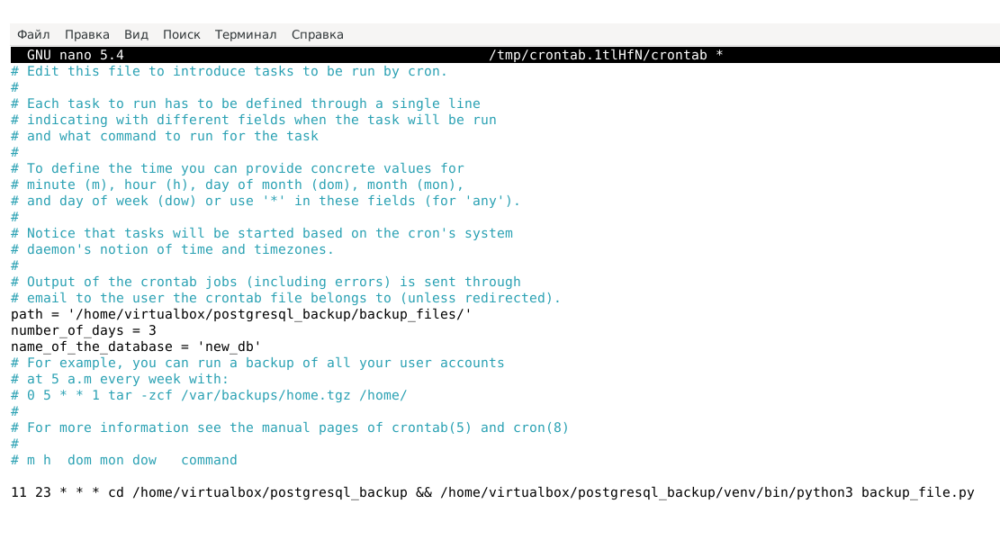

## Бэкапирование БД PostgreSQL с помощью Python в Debian 11 ##

### Задача: ###
1. Бэкапировать БД по расписанию;
2. Программно удалять бэкапы спустя заданное кол-во дней;
2. Передавать параметры с помощью переменных окружения;
3. Логировать процесс выполнения бэкапа.

### Описание файлов: ###
1. backup_file.py - исполняемый файл Python;
2. logfile.log - логирование результата выполнения исполняемого файла;
3. requirements.txt - файл с зависимостями.

### Описание параметров ###
Скрипт взаимодействует со следующими переменными окружения:
1. path - каталог, куда будет записан бэкап и лог процесса выполнения бэкапа;
2. number_of_days - количество дней в течении которых хранится бэкап;
3. name_of_the_database - имя бэкапируемой базы.  

Переменные окружения можно передавать через файл .env, созданный в корне проекта, либо через 
crontab. Расписание запуска скрипта задается с помощью crontab.

Пример:  

В этом примере исполняемый файл запускается каждый день в 23:11, причем сначала происходит переход в папку проекта, 
а потом с помощью интерпретатора, расположенного в папке venv, запускается файл 
backup_file.py.

### Инструкция: ###
1. Скачиваем проект;
2. Устанавливаем зависимости;
3. Создаем виртуальное окружения;
4. С помощью crontab или .env задаем переменные окружения;
5. Настраиваем crontab для запуска по расписанию.

...но предварительно, чтобы не было проблем с запуском скриптов, я с помощью psql создал пользователя с 
тем же именем, что и локальный пользователь. И установил ему полные права над бэкапируемой базой. 
В качестве примера приведу следующий код:

```
postgres=# CREATE USER virtualbox PASSWORD 'masterkey';  

CREATE ROLE

postgres=# ALTER USER virtualbox WITH SUPERUSER;  
ALTER ROLE
              
postgres=# CREATE DATABASE virtualbox;  
CREATE DATABASE

postgres=# CREATE DATABASE test_db;  
CREATE DATABASE

postgres=# GRANT ALL PRIVILEGES ON DATABASE test_db TO virtualbox;  
GRANT
```
### Версии ПО: ###
Debian GNU/Linux 11 (bullseye)  
Python 3.9.2  
PostgreSQL 13.10  
